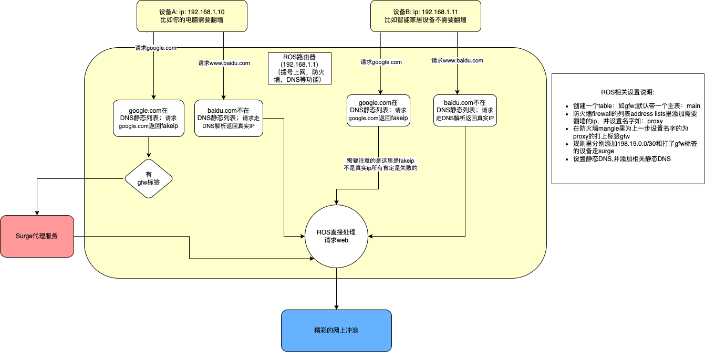

### 首先要知道的一些名词解释（来源网络不正确请指正）

> 什么是 Fake IP 
- 当用户发送 DNS 请求时，代理并不发送请求到远程 DNS 服务器，而是为每个域名返回一个唯一假 IP。
- 在指向这些假 IP 的流量发送到代理时，按查询得到的域名重置当前连接的目标。

> Surge

Surge 是为开发人员设计的 Web 开发和代理实用程序，因此需要专业知识才能使用。
Surge 的核心工作流程包括四个主要功能：
- 接管：Surge 允许用户接管设备发送的网络连接。支持代理服务和虚拟网卡接管。
- 处理：该软件使用户能够修改已被接管的网络请求和响应。这包括 URL 重定向、本地文件映射、使用 JavaScript 的自定义修改以及许多其他方法。
- 转发：网络请求一旦被接管，就可以由用户转发到其他代理服务器。转发可以是全局的，也可以使用灵活的规则系统来确定出站策略。
- 拦截：用户可以截获和保存来自网络请求和响应的特定数据。此外，用户还可以使用 MITM 解密 HTTPS 流量。


## 说明

> 此设置是本人通过大佬的手把手教，设置家里网络时候总结的仅供参考

本次设置是routerOS以后都简称ROS+Surge来搭建的家庭网络环境；简单理解就是我们平常经常流行的爱快+OP的模式；
主路由是ROS,负责拨号上网和DNS解析（有点不一样下边说明）；MacOS安装surge来作为旁路由进行流畅的git访问（节点请自备）;

> 如果你接触过ROS,下边的文字基本上会理解他的原理如果不理解可以看看下边的流程图



```jupyter

假设我有设备A和B, A配置了gfw的标签(这个标签是用来告诉ROS要走surge)；B没配置；
A和B分别访问goole.com简称G(google.com在静态DNS里) 和 baidu.com简称D；
A+G就会匹配静态DNS的fakeip请求去surge请求; 
A+D就直接匹配不到然后走真实ip;
B+G也是会匹配的fakeip但是由于没标签就不会走surge只会走ROS，因为不是DNS解析的DNS肯定访问不到（优：防止DNS,缺点：不能随便配置静态DNS）；
B+D会通过DNS来解析真实ip，ROS直接可以连接
```